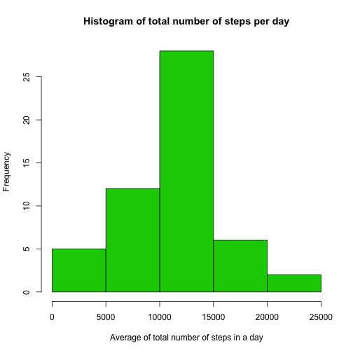
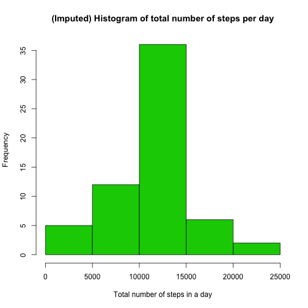
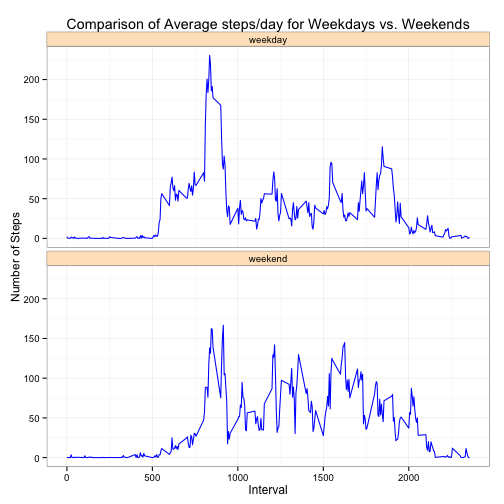

# Reproducible Research: Peer Assessment 1

Setting the environment


```r
#ensure that the data zip file has been copied into the working directory being set below, before you run this code
knitr::opts_chunk$set(echo=TRUE)
setwd("/Users/rameshmaganti/Desktop/coursera/data/RepData_PeerAssessment1")
```
Loading Required libraries:


```r
library(plyr)
library(ggplot2)
```
## Loading and preprocessing the data


```r
unzip("activity.zip")
acts<-read.csv("activity.csv", stringsAsFactors=FALSE)
acts$date<-as.Date(acts$date, format = '%Y-%m-%d')
```

## What is mean total number of steps taken per day?

```r
#ignoring missing data by omitting it
acts2<-na.omit(acts)
# splitting and aggregating data using the plyr package function ddply
tot<-ddply(acts2, .(date), summarize, steps=sum(steps))
# 1. Make a histogram of the total number of steps taken each day
hist(tot$steps, col=3, main="Histogram of total number of steps per day", 
     xlab="Average of total number of steps in a day")
```

 

```r
# 2. Calculate and report the mean and median total number of steps taken per day
mean(tot$steps)
```

```
## [1] 10766
```

```r
median(tot$steps)
```

```
## [1] 10765
```

## What is the average daily activity pattern?

```r
# Make a time series plot (i.e. type = "l") of the 5-minute interval (x-axis) and the average number of steps taken, averaged across all days (y-axis)
tot2<-ddply(acts2, .(interval), summarize, stepmean=mean(steps))
plot(tot2$interval, tot2$stepmean, type="l", xlab="Intervals", ylab="Average Steps", main="Time-Series plot of average steps per interval")
```

 

```r
# Which 5-minute interval, on average across all the days in the dataset, contains the maximum number of steps?
maxSteps<-which.max(tot2$stepmean)
maxStepsInterval<-tot2[maxSteps, ]
maxStepsInterval
```

```
##     interval stepmean
## 104      835    206.2
```
The 835 interval  has the maximum number of steps equal to  206.2

## Imputing missing values

```r
#1. Calculate and report the total number of missing values in the dataset (i.e. the total number of rows with NAs)
missingVals<-length(which(is.na(acts)))
missingVals
```

```
## [1] 2304
```
The total number of missing values in the original dataset are 2304

Devise a strategy for filling in all of the missing values in the dataset. The strategy does not need to be sophisticated. For example, you could use the mean/median for that day, or the mean for that 5-minute interval, etc.

```r
#  Using  mean of steps averaged across all days, to fill the missing value

# using join from plyr package to ensure the order while merging the datasets
#fetching the indices of the NAs in the steps column
#replacing all the NAs with the means computed in the earlier steps
#Finally, creating the imputed dataset with only the desired columns

activity <- join(acts,tot2, by = "interval")
nas<-is.na(activity$steps)
activity$steps[nas]<-activity$stepmean[nas]
activity<-activity[,1:3]

#4. Make a histogram of the total number of steps taken each day.
tot1<-ddply(activity, .(date), summarize, steps=sum(steps))
hist(tot1$steps, col=3, main="(Imputed) Histogram of total number of steps per day", xlab="Total number of steps in a day")
```

 

```r
#From above, mean and median of total number of steps for the non-imputed original data set
mean(tot$steps)
```

```
## [1] 10766
```

```r
median(tot$steps)
```

```
## [1] 10765
```

```r
#mean and median of total number of steps for the imputed data set are:
mean(tot1$steps)
```

```
## [1] 10766
```

```r
median(tot1$steps)
```

```
## [1] 10766
```
From the above we can see that there is no change in mean values, but there is a slight change in median value for the imputed data set

## Are there differences in activity patterns between weekdays and weekends?
For this part the weekdays() function may be of some help here. Use the dataset with the filled-in missing values for this part.

- Create a new factor variable in the dataset with two levels – “weekday” and “weekend” indicating whether a given date is a weekday or weekend day.

```r
#using the weekdays function to convert the dates to their weekday formats, iterating through them and segregating based on weekday/weekend, and finally converting and adding this as a factor to the dataset
activity$daytype<-as.factor(ifelse (weekdays(activity$date) %in% 
                                            c("Saturday", "Sunday"), "weekend", "weekday"))
str(activity$daytype)
```

```
##  Factor w/ 2 levels "weekday","weekend": 1 1 1 1 1 1 1 1 1 1 ...
```

```r
head(activity, n=5)
```

```
##     steps       date interval daytype
## 1 1.71698 2012-10-01        0 weekday
## 2 0.33962 2012-10-01        5 weekday
## 3 0.13208 2012-10-01       10 weekday
## 4 0.15094 2012-10-01       15 weekday
## 5 0.07547 2012-10-01       20 weekday
```

```r
table(activity$daytype)
```

```
## 
## weekday weekend 
##   12960    4608
```

- Make a panel plot containing a time series plot (i.e. type = "l") of the 5-minute interval (x-axis) and the average number of steps taken, averaged across all weekday days or weekend days (y-axis). 

```r
#aggregate data this time by both interval and the factor variable, daytype
#using ggplot from the ggplot2 package to draw a line graph and using facet_grid
#and facet_wrap to have two plots for each of the factor levels
tot3<-ddply(activity, .(interval, daytype), summarize, 
            stMean=mean(steps))
ggplot(tot3, aes(x=interval, y=stMean)) + 
        xlab("Interval")+
        ylab("Number of Steps")+
        labs(title="Comparison of Average steps/day for Weekdays vs. Weekends")+
        geom_line(color="blue")+
        facet_grid(daytype~.)+
        facet_wrap(~daytype, nrow=2)+
        theme_bw()+
        theme(strip.background = element_rect(fill = 'bisque1'))
```

 

For both day types, most activities seem to take place between 8:00 and 9:30 in the morning. The maximum average number of steps during weekdays is higher than that during the weekend, but on average there seem to be more activities during the weekend, especially between 10:00 AM and 8:00 PM.
